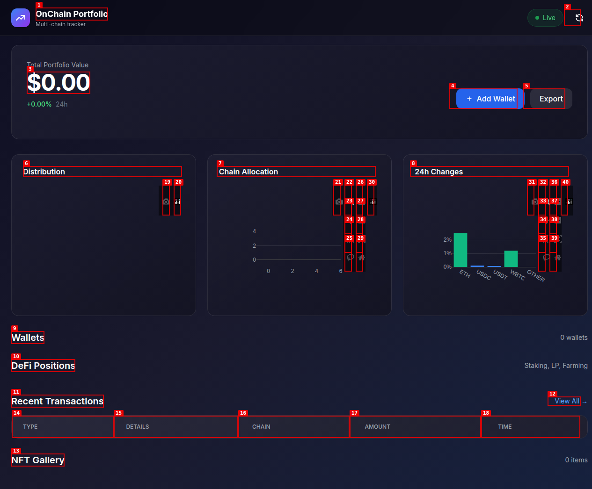

# OnChain Portfolio Tracker

Multi-chain crypto portfolio tracker with DeFi positions, NFT gallery, performance charts, and Telegram bot integration.


## Features

### Multi-Chain Support
- **Ethereum** (ETH, ERC-20)
- **Base** (USDC native)
- **Arbitrum** (ARB ecosystem)
- **Optimism** (OP Stack)
- **BSC** (BNB, BEP-20)
- **Polygon** (MATIC)

### Dashboard
- Total portfolio value with 24h change
- Chain breakdown allocation
- Token distribution pie chart
- Portfolio performance charts (Plotly)
- Wallet management (add/remove/share)
- DeFi positions tracker (staking, LP, farming)
- NFT gallery with floor prices
- Transaction history with filters
- Export portfolio to JSON

### Telegram Bot
- `/start` - Welcome message
- `/balance 0x...` - Check wallet balance
- `/add 0x... chain label` - Add wallet to track
- `/list` - List all tracked wallets
- `/portfolio` - Full portfolio summary
- `/price BTC` - Check token prices

### Public Portfolio Link
Share your portfolio via a unique public URL — perfect for "link in bio" for traders and influencers.

## Installation

```bash
git clone https://github.com/0xspacefun/onchain-portfolio-tracker.git
cd onchain-portfolio-tracker

# Create virtual environment
python3 -m venv venv
source venv/bin/activate

# Install dependencies
pip install -r requirements.txt

# Configure environment
cp .env.example .env
# Edit .env with your API keys

# Run the app
python backend/main.py
```

## Configuration (.env)

```env
SECRET_KEY=your-secret-key
DEBUG=False
PORT=5000

# API Keys (CoinGecko free tier works)
COINGECKO_API_KEY=your-coingecko-api-key

# Telegram Bot (get from @BotFather)
TELEGRAM_BOT_TOKEN=your-telegram-bot-token
ALLOWED_TELEGRAM_USERS=123456789,987654321

# Chain RPCs (public RPCs work, may be rate limited)
ETH_RPC=https://eth.llamarpc.com
BASE_RPC=https://mainnet.base.org
ARB_RPC=https://arb1.arbitrum.io/rpc
OP_RPC=https://mainnet.optimism.io
BSC_RPC=https://bsc-dataseed.binance.org
POLYGON_RPC=https://polygon-rpc.com
```

## API Endpoints

| Method | Endpoint | Description |
|--------|----------|-------------|
| GET | `/api/health` | Health check |
| GET | `/api/portfolio/summary` | Full portfolio summary |
| GET | `/api/wallets` | List all wallets |
| POST | `/api/wallet` | Add new wallet |
| DELETE | `/api/wallet/<id>` | Remove wallet |
| GET | `/api/wallet/<address>/balance?chain=ethereum` | Get wallet balance |
| GET | `/api/wallet/<address>/defi?chain=ethereum` | Get DeFi positions |
| GET | `/api/wallet/<address>/nft?chain=ethereum` | Get NFT holdings |
| GET | `/api/wallet/<address>/txhistory?chain=ethereum&limit=50` | Get transaction history |
| GET | `/api/portfolio/<public_id>` | Public portfolio view |

## Tech Stack

- **Backend**: Flask 3.0, SQLAlchemy, Web3.py
- **Database**: SQLite (can upgrade to PostgreSQL)
- **Scheduler**: APScheduler
- **Telegram Bot**: python-telegram-bot v20
- **Frontend**: HTML5, Tailwind CSS, Plotly.js
- **Charts**: Plotly

## Project Structure

```
onchain-portfolio-tracker/
├── backend/
│   ├── app/
│   │   ├── __init__.py         # Flask app factory
│   │   ├── config.py           # Configuration
│   │   ├── models/
│   │   │   └── database.py     # SQLAlchemy models
│   │   ├── routes/
│   │   │   ├── wallet_routes.py # Wallet API routes
│   │   │   └── telegram_bot.py  # Telegram bot handlers
│   │   └── services/
│   │       ├── chain_scanner.py  # Multi-chain scanner
│   │       ├── price_service.py   # CoinGecko integration
│   │       ├── defi_service.py     # DeFi positions
│   │       └── nft_service.py      # NFT gallery
│   └── main.py
├── templates/
│   ├── dashboard.html         # Main dashboard
│   └── public_portfolio.html  # Public share page
├── requirements.txt
├── .env.example
└── README.md
```

## Screenshots

### Dashboard


### Add Wallet Modal


### Wallet Detail


## Deployment

### VPS (Recommended)
```bash
# Using systemd service
sudo cp deployment/portfolio-tracker.service /etc/systemd/system/
sudo systemctl enable portfolio-tracker
sudo systemctl start portfolio-tracker
```

### Docker
```bash
docker build -t portfolio-tracker .
docker run -d -p 5000:5000 --env-file .env portfolio-tracker
```

### Reverse Proxy (Nginx)
```nginx
server {
    listen 80;
    server_name yourdomain.com;

    location / {
        proxy_pass http://127.0.0.1:5000;
        proxy_set_header Host $host;
        proxy_set_header X-Real-IP $remote_addr;
    }
}
```

## License

MIT License